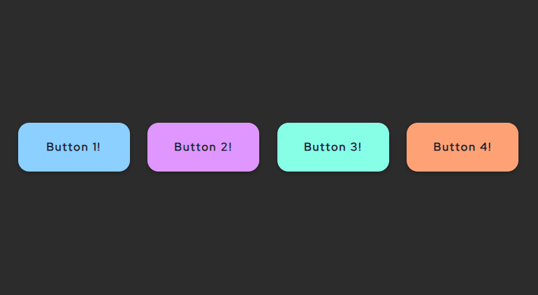

# Button 1

Este projeto apresenta um botão estilizado em **HTML + CSS**, desenvolvido como parte da biblioteca de componentes front-end.  
Pode ser usado em qualquer página web para compor interfaces modernas e responsivas.  

---

## 🎥 Prévia



---

## 📂 Estrutura dos arquivos

front_end/
└── tools/
    └── buttons/
        └── button_1/
            ├── button-1.html   # Estrutura HTML do botão
            ├── button-1.css    # Estilos CSS aplicados
            └── preview.gif     # Animação de demonstração do componente

---

## 🚀 Como usar

1. Copie o código HTML do arquivo `button-1.html` para dentro do seu projeto.  
2. Importe o arquivo CSS `button-1.css` no `<head>` da sua página:  

```html
<link rel="stylesheet" href="button-1.css">
