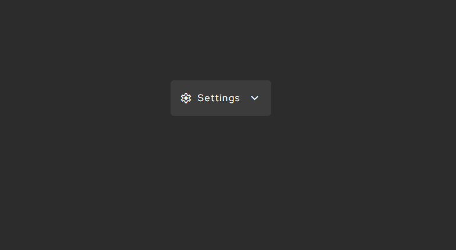

# Dropdown 1

Este projeto apresenta um menu dropdown estilizado em **HTML + CSS**, desenvolvido como parte da biblioteca de componentes front-end.
Pode ser usado em qualquer página web para compor interfaces modernas e responsivas.  

---

## 🎥 Prévia



---

## 📂 Estrutura dos arquivos

- dropdown_1_hover/
  - dropdown-1.html → Estrutura HTML do componente
  - dropdown-1.css → Estilos CSS aplicados
  - preview.gif → Animação ou imagem de demonstração

---

## 🚀 Como usar

1. Copie o código HTML do arquivo `dropdown-1.html` para dentro do seu projeto.  
2. Importe o arquivo CSS `dropdown-1.css` no `<head>` da sua página:  

```html
<link rel="stylesheet" href="dropdown-1.css">
