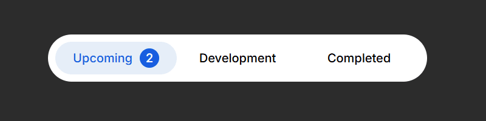

# Sliding Tab Bar 1

Este projeto apresenta uma barra de seleção estilizada em **HTML + CSS**, desenvolvido como parte da biblioteca de componentes front-end.  
Pode ser usado em qualquer página web para compor interfaces modernas e responsivas.  

---

## 🎥 Prévia



---

## 📂 Estrutura dos arquivos

- sliding_tab_bar_1/
  - slidingbar.html → Estrutura HTML do componente
  - slidingbar.css → Estilos CSS aplicados
  - preview.gif → Animação ou imagem de demonstração

---

## 🚀 Como usar

1. Copie o código HTML do arquivo `slidingbar.html` para dentro do seu projeto.  
2. Importe o arquivo CSS `slidingbar.css` no `<head>` da sua página:  

```html
<link rel="stylesheet" href="slidingbar.css">
