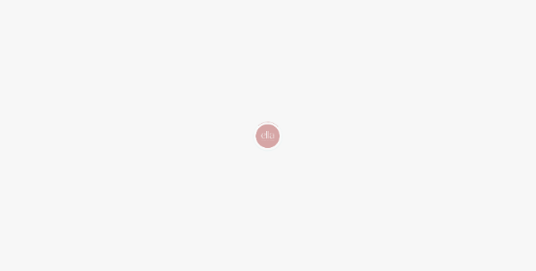

# Ella Intimate Store

Projeto de front-end desenvolvido para a *Ella Intimate Store*, uma loja virtual de produtos íntimos.  
O trabalho foi realizado em parceria com a **SSA Digital**.  
Foi o meu primeiro grande desafio profissional na área de tecnologia.  

O site foi pensado para oferecer uma experiência de compra **moderna, intuitiva e suave**, alinhada ao público-alvo da marca.   

---

## 🎥 Prévia

---

## ✨ Sobre o projeto

O desenvolvimento contemplou toda a camada de **interface e interação do usuário (UI/UX)**.  
Foram utilizadas as tecnologias **HTML5, CSS3 e JavaScript**.  

Durante o processo, trabalhei diretamente com o cliente.  
A cada etapa foram feitos ajustes visuais e funcionais para garantir fidelidade às expectativas.  

---

## 🛠 Tecnologias utilizadas

- **HTML5** → Estrutura semântica das páginas e organização dos conteúdos.  
- **CSS3** → Estilização, responsividade e personalização visual de todos os elementos.  
- **JavaScript** → Interatividade e dinamismo da interface (sliders, pop-ups, carousels).  

---

## 📌 Funcionalidades implementadas

- **Single Slider** na capa, controlado por JavaScript.  
- **Loja de produtos** com carrinho e sistema de favoritos.  
- **Cards de informações** em formato de pop-up dos produtos.  
- **Carousels** para exibição de imagens dos produtos.  
- **Filtros avançados** para facilitar a navegação entre os itens.  
- **E-book digital do cliente**, apresentado em carousel estilizado.  
- **Comentários em destaque** dos clientes na página inicial.  
- **Integração com o blog**, mostrando os últimos posts publicados.  
- **Footer personalizado** com informações da marca.  

---

## 📂 Estrutura dos arquivos

- `/index.html` → Página inicial com o slider principal.
- `/assets/` → Imagens, ícones e demais recursos visuais.
  - `/assets/css/` → Pasta de estilos (CSS3).
  - `/assets/fonts/` → Pasta de fontes.
  - `/assets/img/` → Pasta de imagens.    
  - `/assets/js/` → Pasta com scripts de interatividade.  
  - `/assets/scss` → Arquivos-fonte de estilos em SCSS (pré-processador), compilados para CSS.  

---

## 🚀 Desafios e aprendizados

Este projeto foi um marco na minha jornada:  
- Primeiro grande trabalho no **desenvolvimento front-end**.  
- Responsabilidade de entregar sozinho toda a camada visual.  
- Necessidade de aplicar conceitos de **usabilidade** e **responsividade**.  
- Experiência em **adaptação rápida** às mudanças de requisitos do cliente.  

---

## 📌 Status do projeto

> ⚠️ O projeto encontra-se **parado** devido à ausência de back-end.  
> Toda a camada de **front-end está concluída**, ajustada e validada junto ao cliente.  

---

✦ Desenvolvido por *Rodrigo Canário Cerqueira* em parceria com **SSA Digital**.
